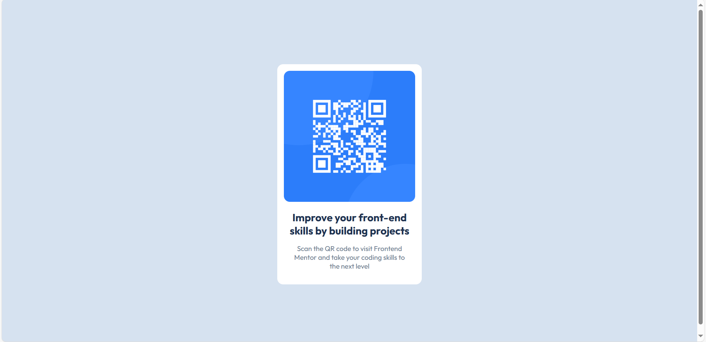

# Frontend Mentor - QR code component solution

This is a solution to the [QR code component challenge on Frontend Mentor](https://www.frontendmentor.io/challenges/qr-code-component-iux_sIO_H). Frontend Mentor challenges help you improve your coding skills by building realistic projects. 

## Table of contents

- [Overview](#overview)
  - [Screenshot](#screenshot)
  - [Links](#links)
  - [Built with](#built-with)
  - [What I learned](#what-i-learned)
- [Author](#author)

## Overview

### Screenshot


### Links

- Solution URL: [https://github.com/j4n1na/qr-code-component-main.git]
- Live Site URL: [https://github.com/j4n1na/qr-code-component-main.git]


### Built with

- Semantic HTML5 markup
- CSS custom properties
- Flexbox


### What I learned

Using Flexbox for Layout:
I learned how to use display: flex on a container (in this case, the <body>) to create flexible and responsive layouts. This makes it simple to center content both vertically and horizontally without using tricky positioning or margins.

Centering Content Vertically and Horizontally:
With align-items: center and justify-content: center, I practiced centering elements perfectly in both axes inside a container, which is a common and useful UI pattern.

Viewport-based Sizing:
By applying min-height: 100vh, I ensured the container takes up the full height of the viewport. This keeps the layout consistent even if there is very little content, which is crucial for creating fullscreen centered designs.

```css
body{
    background-color:  hsl(212, 45%, 89%);
    font-family: 'Outfit', sans-serif;
    display: flex;   /* Enables Flexbox layout on the body */
    align-items: center;   /* Vertically centers the content */
    justify-content: center; /* Horizontally centers the content */
    min-height: 100vh; 

}


## Author

- Frontend Mentor - [@j4n1na](https://www.frontendmentor.io/profile/j4n1na)
